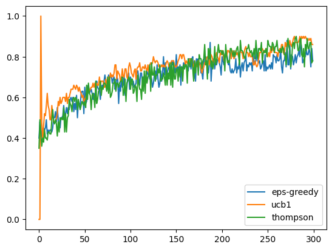
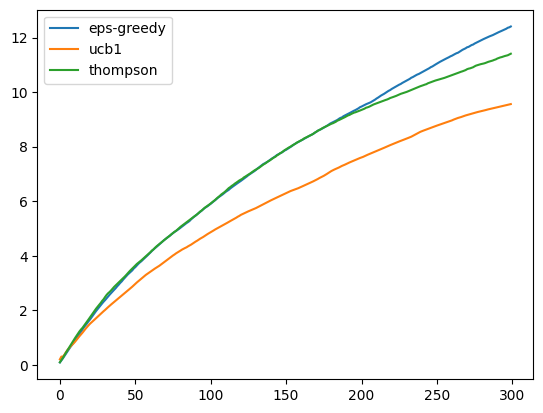

# Bernoulli Bandits

We will walk through an example using **mabby** to run a classic "Bernoulli bandits" simulation.

```python
from mabby import BernoulliArm, Bandit, Metric, Simulation
from mabby.strategies import BetaTSStrategy, EpsilonGreedyStrategy, UCB1Strategy
```

### Configuring bandit arms

First, to set up our simulation, let us start by configuring our multi-armed bandit. We want to simulate a $3$-armed bandit where the rewards of each arm follow Bernoulli distributions with `p` of 0.5, 0.6, and 0.7 respectively.

```python
ps = [0.5, 0.6, 0.7]
```

We create a `BernoulliArm` for each arm, then create a `Bandit` using the list of arms.

```python
arms = [BernoulliArm(p) for p in ps]
bandit = Bandit(arms=arms)
```

Because all our arms are of the same type (i.e., their rewards follow the same type of distribution), we can also use the equivalent shorthand below to create the bandit.

```python
bandit = BernoulliArm.bandit(p=ps)
```

### Configuring bandit strategies

Next, we need to configure the strategies we want to simulate on the bandit we just created. We will compare between three strategies:

- epsilon-greedy algorithm (`EpsilonGreedyStrategy`)
- upper confidence bound (UCB1) algorithm (`UCB1Strategy`)
- Thompson sampling with Beta priors (`BetaTSStrategy`)

We create each of the strategies with the appropriate hyperparameters.

```python
strategy_1 = EpsilonGreedyStrategy(eps=0.2)
strategy_2 = UCB1Strategy(alpha=0.5)
strategy_3 = BetaTSStrategy(general=True)

strategies = [strategy_1, strategy_2, strategy_3]
```

### Running a simulation

Now, we can set up a simulation and run it. We first create a `Simulation` with our bandit and strategies.

```python
simulation = Simulation(
    bandit=bandit, strategies=strategies, names=["eps-greedy", "ucb1", "thompson"]
)
```

Then, we run our simulation for 100 trials of 300 steps each. We also specify that we want to collect statistics on the optimality (`Metric.OPTIMALITY`) and cumulative regret (`Metric.CUM_REGRET`) for each of the strategies. Running the simulation outputs a `SimulationStats` object holding the statistics we requested.

```python
metrics = [Metric.OPTIMALITY, Metric.CUM_REGRET]
stats = simulation.run(trials=100, steps=300, metrics=metrics)
```

### Visualizing simulation statistics

After running our simulation, we can visualize the statistics we collected by calling various plotting methods.

```python
stats.plot_optimality()
```



```python
stats.plot_regret(cumulative=True)
```


